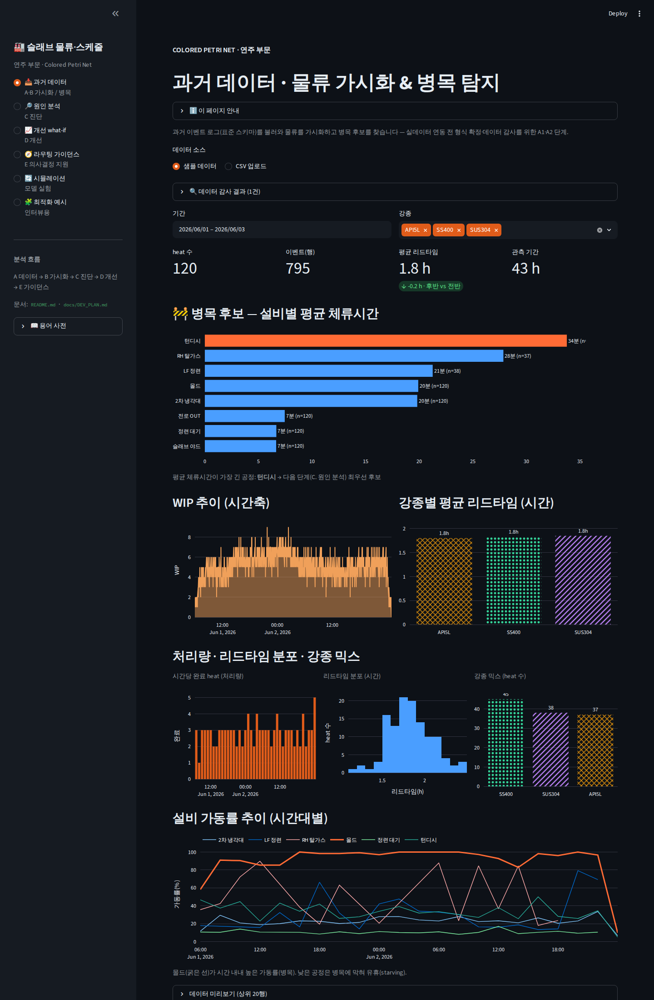
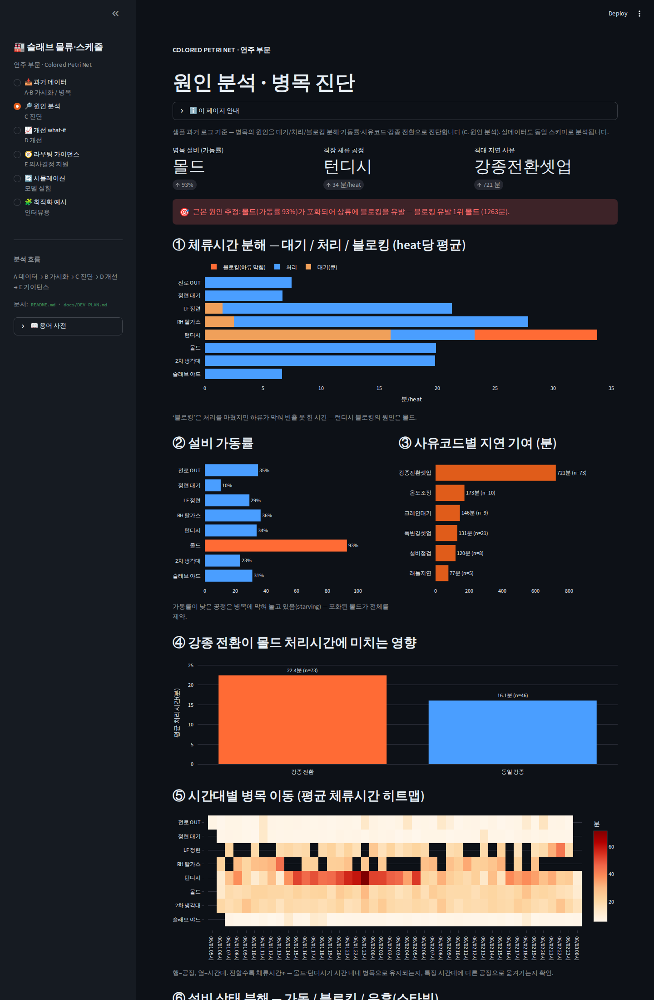

# CPN 슬래브 물류 가시화 — 연주 부문

> **Colored Petri Net(CPN) 기반 슬래브 물류 실시간 가시화 프로토타입**
> 제철소 연주(연속주조) 부문의 슬래브 흐름을 강종별 경로 분기와 함께 시각화·시뮬레이션합니다.

**🔗 라이브 데모**: <https://helpnara.github.io/cpn_slab/> (GitHub Pages · `main` 브랜치 기준)

전로(LD) → 정련(LF / RH) → 연속주조 → 슬래브 야드로 이어지는 공정을,
Colored Petri Net의 **Place(설비·버퍼) / Transition(공정 이벤트) / Token(슬래브)** 개념으로
표현한 단일 HTML 데모입니다. 강종(Color)에 따라 정련 경로가 자동으로 분기됩니다.

---

## 파이썬(Streamlit) 앱 — 분석 파이프라인

최적화 알고리즘·제약 규칙을 반영하기 위해 **파이썬 기반 웹(Streamlit)** 으로 확장했습니다.
가시화 → 진단 → 개선 → 가이던스로 이어지는 분석 파이프라인을 사이드바 네비게이터로
제공합니다. (기존 HTML 프로토타입은 `legacy` 참조용으로 유지 예정)

```bash
pip install -r requirements.txt
streamlit run streamlit_app.py        # → http://localhost:8501
```




### 페이지 구성 (분석 성숙도 A→E)

| 페이지 | 단계 | 내용 |
|--------|------|------|
| 📥 과거 데이터 | A·B 가시화/병목 | 이벤트 로그 로드·감사 → KPI·병목 후보·처리량·분포·믹스·가동률 추이 |
| 🔎 원인 분석 | C 진단 | 체류 분해(대기/처리/블로킹)·가동률·사유코드·강종 전환·시간대 히트맵·설비 상태 |
| 📈 개선 what-if | D 개선 | 주조 순서 재배치(윈도우/전체 그룹핑) 효과 정량화 |
| 🧭 라우팅 가이던스 | E 의사결정 지원 | 신규 슬래브 이동 방향·조치 추천(규칙 기반·설명 가능) |
| 🔄 시뮬레이션 | 모델 실험 | 체류시간·용량 기반 결정적 엔진 |
| 🧩 최적화 예시 | 인터뷰용 | 캐스트 시퀀싱 최적화 예시(값은 가정) |

### 코드 구조

- `src/model.py` 강종/Place/경로 · `src/simulation.py` 시뮬레이션 엔진
- `src/data.py` 이벤트 로그 스키마·로더·지표(A~C) · `src/whatif.py` 개선 비교(D)
- `src/guidance.py` 라우팅 추천(E) · `src/optimization.py` 최적화 예시
- 데이터 요청서: [docs/DATA_REQUEST.md](docs/DATA_REQUEST.md) · 최적화 정의 양식:
  [docs/OPTIMIZATION_SPEC.md](docs/OPTIMIZATION_SPEC.md) · 개발 계획·TODO:
  [docs/DEV_PLAN.md](docs/DEV_PLAN.md)

### 배포

- **Streamlit Community Cloud** (repo `main` · `streamlit_app.py`) — GitHub Pages(정적)로는 불가.
- 인터뷰로 제약이 확정되면 `src/optimization.py`를 OR-Tools CP-SAT로 승급(DEV_PLAN §6).

## 빠른 시작 (기존 HTML 프로토타입)

별도의 빌드·설치 과정이 없습니다. 외부 의존성(폰트·라이브러리·네트워크)이 전혀 없어
파일 하나만으로 동작합니다.

```bash
# 방법 1) 브라우저로 바로 열기
open cpn_slab.html            # macOS
xdg-open cpn_slab.html        # Linux
start cpn_slab.html           # Windows

# 방법 2) 로컬 서버로 열기 (권장 — 일부 브라우저 보안정책 회피)
python3 -m http.server 8000
# → http://localhost:8000/cpn_slab.html 접속
```

iOS Safari에서 로컬 파일로 직접 열어도 동작하도록 설계되어 있습니다
(외부 폰트 제거, `requestAnimationFrame` 기반 루프). 자세한 배경은
[docs/ARCHITECTURE.md](docs/ARCHITECTURE.md#ios-safari-호환) 참고.

## 사용법

| 조작 | 설명 |
|------|------|
| **▶ 시뮬레이션 시작** | 슬래브 토큰이 투입되며 체류시간·용량 규칙에 따라 공정을 따라 이동합니다 |
| **↺ 초기화** | 모든 토큰·통계·로그·차트·대기열을 리셋합니다 |
| **속도** | 스텝 간격을 보통(1500ms) / 빠름(800ms) / 매우 빠름(400ms)으로 변경 |
| **입력부 — 투입 예약** | 강종·두께·수량을 지정해 슬래브를 수동 투입 대기열에 넣습니다 |
| **입력부 — 파라미터** | 자동 투입 on/off, 투입 확률, 최대 WIP, 병목 임계를 실행 중 실시간 조절 |
| **슬래브(●) 클릭** | 해당 슬래브를 토큰 목록에서 하이라이트 |

화면은 크게 6개 영역으로 구성됩니다.

1. **공정 흐름 다이어그램** — Place/Transition 네트워크와 이동 중인 토큰(블로킹 시 적색 링)
2. **입력부** — 동적 투입(대기열) + 실시간 파라미터
3. **현재 공정 내 슬래브(토큰) 목록** — 강종·두께·온도·병목 여부·현재 위치
4. **공정 이벤트 로그** — 투입/이동/Guard 분기/완료 이벤트
5. **핵심 지표** — 야드 입고, 공정 중 슬래브, 병목 경보, 평균 리드타임, 처리량
6. **심층 분석** — WIP 추이, Place별 점유/용량, 강종별 평균 리드타임

## 강종별 경로 (Color-based Routing)

| 강종 | 분류 | 정련 경로 | 색상 |
|------|------|-----------|------|
| **SUS304** | 스테인리스 | 전로 → 정련대기 → **LF** → 턴디시 → … | 🟣 보라 |
| **SS400** | 일반구조용 | 전로 → 정련대기 → **직행** → 턴디시 → … | 🟢 초록 |
| **API5L** | 파이프라인강 | 전로 → 정련대기 → **RH(탈가스)** → 턴디시 → … | 🟠 주황 |

경로 분기 규칙(Guard)과 전체 공정 정의는
[docs/ARCHITECTURE.md](docs/ARCHITECTURE.md)에 정리되어 있습니다.

## 저장소 구조

```
cpn_slab/
├── cpn_slab.html          # 애플리케이션 본체 (HTML + CSS + JS 단일 파일)
├── index.html             # GitHub Pages 루트 진입점 → cpn_slab.html 리다이렉트
├── README.md              # 이 문서
├── CLAUDE.md              # AI 보조 작업(Claude Code)용 가이드
└── docs/
    ├── ARCHITECTURE.md    # CPN 모델 · 코드 구조 상세
    ├── MAINTENANCE.md     # 확장/수정 방법 (강종·공정 추가 등)
    └── ROADMAP.md         # 알려진 한계 · 개선 백로그
```

## 기술 스택

- **순수 프론트엔드**: HTML + CSS + 바닐라 JavaScript (프레임워크·번들러 없음)
- **다이어그램**: 인라인 SVG (외부 라이브러리 없음)
- **애니메이션**: `requestAnimationFrame` 기반 틱 루프
- **의존성 0**: 외부 폰트·CDN·네트워크 요청 없음 → 오프라인/로컬 파일 실행 가능

## ⚠️ 프로토타입 범위 안내

현재 버전은 **개념 검증용 시각화 프로토타입**입니다. 토큰 이동은 Place별
체류시간(proc)과 용량(cap)에 따른 결정적 규칙으로 동작하며(용량이 차면 상류가
블로킹되어 실제 병목을 재현), 투입은 수동 대기열 또는 자동(확률)으로 이뤄집니다.
아직 실제 공장 데이터(MES) 연동과 정식 CPN 시맨틱(Guard/Arc 표현식, 마킹) 은
포함되어 있지 않습니다 — 진행 상황과 다음 단계는
[docs/ROADMAP.md](docs/ROADMAP.md)를 참고하세요.
